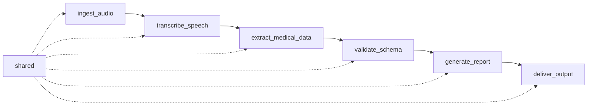

# 02 — Planning Phase

## 1. Project Management Framework

Agile approach with Scrum framework

## 2. Quality Framework

### Quality Framework — V-Model Mapping

### Requirements & Specification

- **Requirements-driven development** — think through requirements thoroughly so the AI generates correct code
- **Write tests first** — TDD approach: define expected behavior before generating implementation

### Design & Architecture

- **Modularity** — design for separation of concerns from the start
- **Testability** — structure code so it can be tested in isolation
- **Security test templates** — design the security test surface before touching code; reusable across features

### Implementation

- **Static analysis tools** — configured once, applied consistently across the codebase
- **Documentation & code comments** — explain _why_ something is done, not just _what_ it does
- **Version control discipline** — clean commits, meaningful messages, branching strategy
- **Logging** — add logging requirements directly to the code generation prompt
- **Environment & configuration testing** — ask the AI explicitly to generate env-aware, config-aware code

### Integration & Unit Testing

- **Reusable test suite** — tests that can be run consistently across changes
- **Automated security scanning** — runs as part of the integration pipeline
- **Four-eyes / code review principle** — human verification gate before merging

### System & Acceptance Testing

- **Performance testing** — measure response times, query counts, and memory usage at the system level

### Operation

- **Observability** — set alerts for unusual patterns, failed authentication attempts, and unexpected errors; runtime feedback loop into the next iteration

## 3. Team Collaboration

## 4. Development Tools

| Area                     | Selected tool          | Alternative         | Reason to reject                                |
| ------------------------ | ---------------------- | ------------------- | ----------------------------------------------- |
| Backlog management       | GitHub Projects        | Notion              | No code traceability                            |
| Backlog management       | GitHub Projects        | Jira                | Excessive config for a two-person team          |
| Source control           | GitHub                 | Bitbucket           | Smaller ecosystem, lower AI stack compatibility |
| CI/CD                    | GitHub Actions         | Bitbucket Pipelines | Linux-only, incompatible with GitHub            |
| Requirements engineering | StrictDoc              | —                   | —                                               |
| Documentation            | GitHub Repository Wiki | —                   | —                                               |

## 5. Technology Stack

| Area            | Tool                                                      |
| --------------- | --------------------------------------------------------- |
| Language        | TypeScript                                                |
| Runtime         | Node.js 22+                                               |
| Package manager | pnpm + Workspaces                                         |
| Bundler         | tsdown                                                    |
| Linter          | Oxlint                                                    |
| Formatter       | Prettier (changed because oxfmt is not available in pnpm) |
| Test runner     | Vitest                                                    |

## 6. Development Flow — V-Model Process

### Phase 1: Requirements & Specification

**Goal:** Define _what_ to build before writing any code.

| #   | Activity                                         | Tool             | Output                                        |
| --- | ------------------------------------------------ | ---------------- | --------------------------------------------- |
| 1   | Create requirement with unique UID               | StrictDoc        | `docs/requirements/*.sdoc` with UID           |
| 2   | Write statement, inputs, outputs, constraints    | StrictDoc        | Requirement statement and acceptance criteria |
| 3   | Write acceptance test skeleton (test-first)      | Vitest           | `tests/<feature>.test.ts` with `@sdoc[UID]`   |
| 4   | Define expected behavior in test assertions      | Vitest           | Failing tests that describe the requirement   |
| 5   | Link test file to requirement via `@sdoc` marker | StrictDoc + IDE  | Traceability between requirement and test     |
| 6   | Validate traceability                            | StrictDoc export | Requirement appears in traceability matrix    |

**Requirements-driven development:**

- Activities 1–2 force thinking through the requirement thoroughly before any implementation
- The requirement UID becomes the single source of truth referenced by code and tests

**Write tests first (TDD):**

- Activities 3–5 produce a failing test suite that encodes the expected behavior
- Implementation (Phase 3) starts only after tests exist and fail for the right reason

### Phase 2: Design & Architecture

**Goal:** Structure the solution for modularity, testability, and security before implementation.

| #   | Activity                                                  | Tool             | Output                                                  |
| --- | --------------------------------------------------------- | ---------------- | ------------------------------------------------------- |
| 1   | Define module boundaries and separation of concerns       | IDE + Wiki       | Module diagram or description in documentation          |
| 2   | Define processing flow (step, module, input, output, REQ) | IDE + Wiki       | Flow table in planning doc (see example below)          |
| 3   | Design interfaces and data contracts (types/interfaces)   | TypeScript       | `src/<module>/types.ts` with exported interfaces        |
| 4   | Ensure each module can be tested in isolation             | TypeScript       | Dependency injection points, no hard-coded dependencies |
| 5   | Design security test surface for the feature              | Vitest           | `tests/<feature>.security.test.ts` skeleton             |
| 6   | Create reusable security test templates                   | Vitest           | `tests/templates/security.ts` shared assertions         |
| 7   | Review design against requirements                        | StrictDoc + Wiki | Design decisions documented, linked to requirement UIDs |

**Modularity:**

- Activities 1–4 ensure code is structured into isolated, independently testable modules from the start

**Testability:**

- Activity 4 enforces dependency injection so units can be tested without external services

**Security test templates:**

- Activities 5–6 define the security test surface before touching implementation code; templates are reusable across features

### Module Boundaries (Example for Activity 1)

- Solid arrows represent the **data flow** between modules
- Dashed arrows represent **shared dependencies** (types, constants)
- Each box is an **independent module** with its own interfaces

### Processing Flow (Example for Activity 2)

| Step | Module                 | Input            | Output              | Requirement  |
| ---- | ---------------------- | ---------------- | ------------------- | ------------ |
| 1    | `ingest_audio`         | Raw audio stream | Audio file          | REQ-FUNC-001 |
| 2    | `transcribe_speech`    | Audio file       | Raw text            | REQ-FUNC-002 |
| 3    | `extract_medical_data` | Raw text         | Structured entities | REQ-FUNC-003 |
| 4    | `validate_schema`      | Entities         | Validated record    | REQ-FUNC-004 |
| 5    | `generate_report`      | Validated record | Report document     | REQ-FUNC-005 |
| 6    | `deliver_output`       | Report           | API response        | REQ-FUNC-006 |

### Phase 3: Implementation

**Goal:** Write production code that passes the existing tests, following consistent standards and full traceability.

| #   | Activity                                                        | Tool              | Output                                                       |
| --- | --------------------------------------------------------------- | ----------------- | ------------------------------------------------------------ |
| 1   | Configure static analysis rules for the module                  | Oxlint + Prettier | Linter and formatter config validated for the module         |
| 2   | Implement the module to pass the failing tests from Phase 1     | TypeScript + IDE  | `src/<module>/*.ts` — production code that makes tests green |
| 3   | Add `@sdoc[UID]` markers in source code linking to requirements | IDE               | Traceability between requirement and implementation          |
| 4   | Add inline documentation explaining _why_ (not _what_)          | IDE               | Code comments that capture design rationale                  |
| 5   | Follow branching strategy: feature branch, meaningful commits   | Git               | Clean commit history with descriptive messages               |
| 6   | Add structured logging statements per the requirement spec      | TypeScript        | Log output covering key operations and error paths           |
| 7   | Add environment/config awareness (env vars, config validation)  | TypeScript        | Config-aware code with validation at startup                 |
| 8   | Run linter and formatter before committing                      | Oxlint + Prettier | `pnpm format` + lint pass with zero errors                   |
| 9   | Verify all Phase 1 tests pass                                   | Vitest            | All requirement-linked tests green                           |

**Static analysis tools:**

- Activities 1 and 8 ensure consistent code quality — rules are configured once and applied across the entire codebase
- Linting and formatting run before every commit (`pnpm format` via pre-commit hook)

**Documentation & code comments:**

- Activity 4 enforces explaining _why_ something is done, not just _what_ it does
- Comments capture design decisions and constraints that are not obvious from the code itself

**Version control discipline:**

- Activity 5 enforces clean commits with meaningful messages and a consistent branching strategy
- Each feature branch maps to a requirement UID for traceability

**Logging:**

- Activity 6 adds logging requirements directly to the implementation — log levels, structured messages, and error context
- Logging statements are derived from the requirement spec, not added as an afterthought

**Environment & configuration testing:**

- Activity 7 ensures code reads configuration from environment variables and validates them at startup
- The AI is explicitly asked to generate env-aware, config-aware code during implementation

### Phase 4: Integration & Unit Testing

**Goal:** Verify that modules work correctly in isolation and together, with automated security scanning and human review.

| #   | Activity                                                      | Tool             | Output                                           |
| --- | ------------------------------------------------------------- | ---------------- | ------------------------------------------------ |
| 1   | Run unit tests for the implemented module                     | Vitest           | All unit tests pass for the module in isolation  |
| 2   | Run integration tests across dependent modules                | Vitest           | Cross-module interactions verified               |
| 3   | Run automated security scanning on the codebase               | GitHub Actions   | Security scan report with zero critical findings |
| 4   | Review security test results from Phase 2 templates           | Vitest           | `tests/<feature>.security.test.ts` passing       |
| 5   | Execute code review (four-eyes principle)                     | GitHub PR        | PR reviewed and approved by second team member   |
| 6   | Verify requirement traceability (tests ↔ code ↔ requirements) | StrictDoc export | Traceability matrix updated, no orphaned items   |
| 7   | Merge feature branch after approval                           | Git              | Feature branch merged to main with clean history |

**Reusable test suite:**

- Activities 1–2 use the test skeletons written in Phase 1 — tests are designed to be run consistently across every change
- Tests are deterministic, isolated, and repeatable in CI

**Automated security scanning:**

- Activity 3 runs security scans as part of the integration pipeline (TruffleHog for secrets, dependency audit for vulnerabilities)
- Activity 4 validates that the security test templates from Phase 2 pass against the implementation

**Four-eyes / code review principle:**

- Activity 5 enforces a human verification gate — no code merges without a second pair of eyes
- The reviewer checks correctness, style, traceability markers, and logging completeness

### Phase 5: System & Acceptance Testing

**Goal:** Validate that the complete system meets requirements and performs within acceptable limits.

| #   | Activity                                               | Tool                       | Output                                             |
| --- | ------------------------------------------------------ | -------------------------- | -------------------------------------------------- |
| 1   | Deploy the integrated system to a staging environment  | GitHub Actions             | Staging environment running the latest build       |
| 2   | Run end-to-end acceptance tests against staging        | Vitest                     | All acceptance criteria from requirements verified |
| 3   | Measure response times for critical operations         | Vitest + custom benchmarks | Response time report per endpoint/operation        |
| 4   | Measure query counts and database interactions         | Logging + monitoring       | Query count report, no unexpected N+1 patterns     |
| 5   | Measure memory usage under expected load               | Node.js diagnostics        | Memory profile within defined thresholds           |
| 6   | Compare results against requirement-defined thresholds | StrictDoc + reports        | Pass/fail per non-functional requirement           |
| 7   | Obtain Product Owner acceptance of the increment       | GitHub PR / meeting        | Increment accepted or feedback captured in backlog |

**Performance testing:**

- Activities 3–5 measure response times, query counts, and memory usage at the system level
- Thresholds are derived from non-functional requirements (linked via REQ UIDs)
- Performance regressions are caught before reaching production

### Phase 6: Operation

**Goal:** Monitor the running system, detect anomalies, and feed runtime insights back into the next iteration.

| #   | Activity                                                    | Tool                      | Output                                              |
| --- | ----------------------------------------------------------- | ------------------------- | --------------------------------------------------- |
| 1   | Configure alerts for unusual patterns and unexpected errors | Monitoring platform       | Alert rules covering critical paths                 |
| 2   | Configure alerts for failed authentication attempts         | Monitoring platform       | Security-specific alert rules                       |
| 3   | Set up structured log aggregation from production           | Logging infrastructure    | Centralized, searchable log dashboard               |
| 4   | Define runtime health checks and uptime monitoring          | GitHub Actions / external | Health check endpoints verified periodically        |
| 5   | Review runtime feedback and create backlog items            | GitHub Issues             | New issues or requirements from production insights |
| 6   | Feed lessons learned into the next sprint planning          | Team meeting              | Retrospective actions and updated requirements      |

**Observability:**

- Activities 1–3 set alerts for unusual patterns, failed authentication attempts, and unexpected errors
- Activities 5–6 close the runtime feedback loop — production insights feed directly into the next iteration
- Observability is not an afterthought; it is designed alongside the feature
